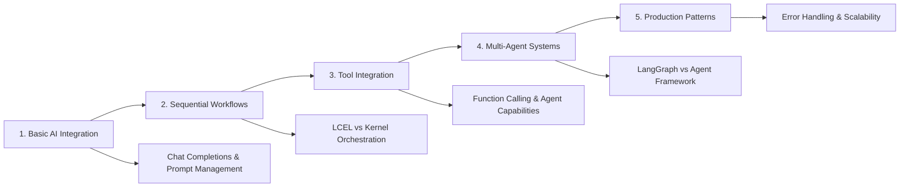

# LangChain vs Semantic Kernel: A Comprehensive Framework Comparison

This repository provides a hands-on, code-first comparison of two leading AI application frameworks: **LangChain** and **Microsoft's Semantic Kernel**. Rather than declaring a winner, this project illuminates each framework's unique strengths and optimal use cases through practical examples and multi-agent implementations.

## 🚀 What's New (2024 Updates)

> [!NOTE]
> This project has been completely updated with the latest 2024 patterns and enterprise-ready implementations.

- [x] **Azure OpenAI Integration**: Enterprise-ready examples using Azure OpenAI
- [x] **Latest Framework Versions**: Updated to LangChain 0.3+ and Semantic Kernel 1.0+
- [x] **Multi-Agent Systems**: LangGraph vs Semantic Kernel Agent Framework comparisons
- [x] **Deprecation Fixes**: Modern LCEL patterns replace deprecated LLMChain
- [x] **Production Patterns**: Environment variable management and security best practices

## 📊 Key Findings

| Framework | Strengths | Best For |
|-----------|-----------|----------|
| **🦜 LangChain** | • LCEL composition patterns<br>• LangGraph multi-agent workflows<br>• 700+ integrations<br>• Research flexibility | • Rapid prototyping<br>• Complex agent orchestration<br>• Experimental systems<br>• Community-driven projects |
| **🧠 Semantic Kernel** | • Enterprise patterns<br>• Multi-language support<br>• Agent Framework<br>• Azure integration | • Production systems<br>• Microsoft ecosystem<br>• Structured architectures<br>• Enterprise governance |

## 🏗️ Project Structure

```
📁 SemanticKernelLangChainComparison/
├── 📄 .env.template                           # Environment configuration template
├── 📄 .gitignore                             # Git ignore with security patterns  
├── 📄 README.md                              # This comprehensive guide
├── 📄 requirements.txt                       # Python dependencies
├── 📁 .vscode/                               # VS Code workspace optimization
│   ├── 📄 extensions.json                   # Matt Bierner markdown extensions
│   └── 📄 settings.json                     # Workspace settings
├── 📁 notebooks/                             # Progressive learning notebooks
│   ├── 📓 1_exploring_langchain.ipynb       # LangChain fundamentals + LCEL
│   ├── 📓 2_exploring_semantic_kernel.ipynb # Semantic Kernel fundamentals
│   ├── 📓 3_langchain_agents_langgraph.ipynb # LangGraph multi-agent systems
│   └── 📓 4_semantic_kernel_agents.ipynb    # SK Agent Framework patterns
└── 📁 docs/                                  # Comprehensive documentation
    ├── 📄 1_introduction.md                 # Framework evolution & philosophies
    ├── 📄 2_architectural_components.md     # Component comparison matrix
    ├── 📄 3_langchain_deep_dive.md         # LCEL patterns & LangGraph
    ├── 📄 4_semantic_kernel_deep_dive.md   # Plugins & Agent Framework
    ├── 📄 5_comparative_analysis.md        # Production readiness analysis
    └── 📄 6_conclusion_recommendations.md  # Decision framework & roadmap
```

## ⚡ **Quick Start**

### Prerequisites
- Python 3.8+
- Azure OpenAI resource with deployed models
- Tavily API key (for search functionality)

### 1. Clone and Setup
```bash
git clone <repository-url>
cd SemanticKernelLangChainComparison
python -m venv .venv
source .venv/bin/activate  # Windows: .venv\Scripts\activate
pip install -r requirements.txt
```

### 2. Configure Environment
```bash
cp .env.template .env
# Edit .env with your actual API keys and endpoints
```

**Required Environment Variables:**
```env
AZURE_OPENAI_API_KEY=your_azure_openai_api_key
AZURE_OPENAI_ENDPOINT=https://your-resource.openai.azure.com/
AZURE_OPENAI_CHAT_DEPLOYMENT_NAME=gpt-4o-mini
TAVILY_API_KEY=your_tavily_api_key
```

### 3. Launch Jupyter
```bash
jupyter lab
```

### 4. Run Notebooks

> [!TIP]
> Follow the progressive learning path for best understanding:

1. **Start with**: `1_exploring_langchain.ipynb` - LangChain fundamentals
2. **Then**: `2_exploring_semantic_kernel.ipynb` - Semantic Kernel basics  
3. **Advanced**: `3_langchain_agents_langgraph.ipynb` - LangGraph workflows
4. **Enterprise**: `4_semantic_kernel_agents.ipynb` - Agent Framework

## 🔧 **Development Environment**

### VS Code Integration
This project includes optimized VS Code settings with:
- **Matt Bierner's Markdown Extensions**: GitHub-style preview + Mermaid diagrams
- **Jupyter Integration**: Enhanced notebook experience
- **Python Tools**: Formatting, linting, debugging

Open in VS Code and accept the recommended extensions for the best experience.

### Package Management
Core dependencies include:
```
langchain-openai>=0.1.0     # Azure OpenAI integration
semantic-kernel>=1.0.0      # Microsoft Semantic Kernel
langchain-community>=0.2.0  # Community tools & integrations
tavily-python>=0.3.0        # Search functionality
python-dotenv>=1.0.0        # Environment management
```

## 🧠 **What You'll Learn**

### Framework Comparison Areas



### Advanced Patterns Covered

| Framework | Core Patterns | Advanced Capabilities |
|-----------|---------------|----------------------|
| **🦜 LangChain** | LCEL composition, Streaming, Tool binding | LangGraph workflows, State management, Complex routing |
| **🧠 Semantic Kernel** | Plugin architecture, Kernel orchestration | Agent Framework, Group chat, Enterprise governance |

## 📚 **Documentation Deep Dive**

### **Architecture Analysis**
- **[Introduction](docs/1_introduction.md)**: Core philosophies and design patterns
- **[Components](docs/2_architectural_components.md)**: Side-by-side feature comparison
- **[Comparative Analysis](docs/5_comparative_analysis.md)**: Visual architecture diagrams

### **Implementation Guides**
- **[LangChain Patterns](docs/3_langchain_deep_dive.md)**: LCEL, agents, and modern patterns
- **[Semantic Kernel Patterns](docs/4_semantic_kernel_deep_dive.md)**: Plugins, orchestration, and Azure integration
- **[Decision Framework](docs/6_conclusion_recommendations.md)**: When to choose which framework

## 🎯 **Making the Right Choice**

### Decision Matrix

| Use Case | LangChain | Semantic Kernel |
|----------|-----------|-----------------|
| **🔬 Research & Experimentation** | ✅ Ideal | ⚠️ Possible |
| **⚡ Rapid Prototyping** | ✅ Excellent | ⚠️ Structured |
| **🏢 Enterprise Production** | ⚠️ Custom setup | ✅ Built-in |
| **🌐 Multi-Language Support** | ❌ Python focus | ✅ C#/Java/Python |
| **🔗 Community Integrations** | ✅ 700+ tools | ⚠️ Microsoft-focused |
| **🛡️ Enterprise Governance** | ⚠️ Custom impl. | ✅ Built-in |

> [!IMPORTANT]
> Both frameworks can deliver production-ready applications - the choice depends on organizational context and requirements.

## 🔐 **Security Best Practices**

- **Environment Variables**: All sensitive data in `.env` files
- **Git Security**: `.env` files excluded from version control
- **Production Patterns**: Configuration validation and error handling
- **API Key Management**: Secure storage and rotation practices

## 🛠️ Troubleshooting

<details>
<summary>📋 Common Issues & Solutions</summary>

### ❌ Missing API Keys
- **Problem**: Authentication errors or missing keys
- **Solution**: Ensure `.env` file is configured with all required keys
- **Check**: `AZURE_OPENAI_API_KEY` and `TAVILY_API_KEY` are set

### 📦 Package Conflicts  
- **Problem**: Import errors or version conflicts
- **Solution**: Use clean virtual environment and latest `requirements.txt`
- **Commands**: 
  ```bash
  python -m venv .venv
  source .venv/bin/activate  # or .venv\Scripts\activate on Windows
  pip install -r requirements.txt
  ```

### 🪐 Jupyter Kernel Issues
- **Problem**: Kernel not finding packages
- **Solution**: Verify kernel is using the correct virtual environment
- **Check**: Kernel shows `.venv` in Jupyter interface

### ☁️ Azure OpenAI Configuration
- **Problem**: Deployment or API version errors  
- **Solution**: Verify deployment names and API versions in Azure portal
- **Common**: Use `2024-05-01-preview` for API version

</details>

### Getting Help

> [!TIP]
> For fastest resolution:
> 1. Check notebook error outputs for specific issues
> 2. Verify environment variable configuration  
> 3. Confirm Azure OpenAI deployment status
> 4. Ensure virtual environment activation

## 📈 **Project Evolution**

This comparison project reflects the latest developments in both frameworks:
- **LangChain 0.3+**: LCEL patterns, LangGraph multi-agent systems
- **Semantic Kernel 1.0+**: Agent Framework, Azure integration improvements
- **Azure OpenAI**: Enterprise-ready patterns and best practices

The goal is to provide developers with practical, hands-on experience to make informed architecture decisions based on real-world use cases and requirements.