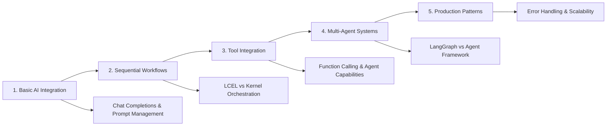

# LangChain vs Semantic Kernel: A Comprehensive Framework Comparison

This repository provides a hands-on, code-first comparison of two leading AI application frameworks: **LangChain** and **Microsoft's Semantic Kernel**. Rather than declaring a winner, this project illuminates each framework's unique strengths and optimal use cases through practical examples and multi-agent implementations.

## 🚀 What's New (2025 Updates)

> [!NOTE]
> This project has been completely updated with the latest 2025 patterns, production frameworks, and comprehensive evaluation tools.

- [x] **LangGraph Integration**: Modern agent framework replacing legacy AgentExecutor
- [x] **LangSmith Monitoring**: Production-ready tracing and evaluation workflows
- [x] **Semantic Kernel 1.0 GA**: Agent Framework with AutoGen integration patterns
- [x] **Modern Evaluation**: DeepEval, Humanloop, and MLflow integration examples
- [x] **Cost Optimization**: Built-in token tracking and performance monitoring
- [x] **Production Patterns**: Memory-enabled agents with conversation threading

## 📊 Key Findings

| Framework              | 2025 Strengths                                                                                                         | Best For                                                                                                      |
| ---------------------- | ----------------------------------------------------------------------------------------------------------------- | ------------------------------------------------------------------------------------------------------------- |
| **🦜 LangChain**       | • LangGraph state management<br>• LangSmith production monitoring<br>• Memory-enabled agents<br>• DeepEval integration | • Complex multi-agent systems<br>• Production monitoring<br>• Evaluation pipelines<br>• Rapid experimentation |
| **🧠 Semantic Kernel** | • Agent Framework 1.0 GA<br>• Process Framework<br>• AutoGen convergence<br>• Enterprise governance                     | • Structured agent systems<br>• Microsoft ecosystem<br>• Multi-language support<br>• Enterprise compliance        |

## 🏗️ Project Structure

```
📁 SemanticKernelLangChainComparison/
├── 📄 .env.template                           # Environment configuration template
├── 📄 .gitignore                             # Git ignore with security patterns
├── 📄 README.md                              # This comprehensive guide
├── 📄 requirements.txt                       # Python dependencies
├── 📁 .vscode/                               # VS Code workspace optimization
│   ├── 📄 extensions.json                   # Matt Bierner markdown extensions
│   └── 📄 settings.json                     # Workspace settings
├── 📁 notebooks/                             # Progressive learning notebooks (2025 Edition)
│   ├── 📓 1_exploring_langchain.ipynb       # LangChain + LangGraph + LangSmith
│   ├── 📓 2_exploring_semantic_kernel.ipynb # Semantic Kernel + Agent Framework  
│   ├── 📓 3_langchain_agents_langgraph.ipynb # Advanced LangGraph multi-agent workflows
│   └── 📓 4_semantic_kernel_agents.ipynb    # SK Agent Framework + AutoGen patterns
└── 📁 docs/                                  # Comprehensive documentation
    ├── 📄 1_introduction.md                 # Framework evolution & philosophies
    ├── 📄 2_architectural_components.md     # Component comparison matrix
    ├── 📄 3_langchain_deep_dive.md         # LCEL patterns & LangGraph
    ├── 📄 4_semantic_kernel_deep_dive.md   # Plugins & Agent Framework
    ├── 📄 5_comparative_analysis.md        # Production readiness analysis
    └── 📄 6_conclusion_recommendations.md  # Decision framework & roadmap
```

## ⚡ **Quick Start**

### Prerequisites

- Python 3.8+
- Azure OpenAI resource with deployed models
- Tavily API key (for search functionality)
- LangSmith API key (optional, for production monitoring)
- DeepEval setup (optional, for advanced evaluation)

### 1. Clone and Setup

```bash
git clone <repository-url>
cd SemanticKernelLangChainComparison
python -m venv .venv
source .venv/bin/activate  # Windows: .venv\Scripts\activate
pip install -r requirements.txt
```

### 2. Configure Environment

```bash
cp .env.template .env
# Edit .env with your actual API keys and endpoints
```

**Required Environment Variables:**

```env
# Core Requirements
AZURE_OPENAI_API_KEY=your_azure_openai_api_key
AZURE_OPENAI_ENDPOINT=https://your-resource.openai.azure.com/
AZURE_OPENAI_CHAT_DEPLOYMENT_NAME=gpt-4o-mini
TAVILY_API_KEY=your_tavily_api_key

# 2025 Production Monitoring (Optional)
LANGCHAIN_API_KEY=your_langsmith_api_key
LANGCHAIN_TRACING_V2=true
LANGCHAIN_PROJECT=YourProjectName
```

### 3. Launch Jupyter

```bash
jupyter lab
```

### 4. Run Notebooks

> [!TIP]
> Follow the progressive learning path for best understanding:

1. **Start with**: `1_exploring_langchain.ipynb` - LangChain fundamentals
2. **Then**: `2_exploring_semantic_kernel.ipynb` - Semantic Kernel basics
3. **Advanced**: `3_langchain_agents_langgraph.ipynb` - LangGraph workflows
4. **Enterprise**: `4_semantic_kernel_agents.ipynb` - Agent Framework

## 🔧 **Development Environment**

### VS Code Integration

This project includes optimized VS Code settings with:

- **Matt Bierner's Markdown Extensions**: GitHub-style preview + Mermaid diagrams
- **Jupyter Integration**: Enhanced notebook experience
- **Python Tools**: Formatting, linting, debugging

Open in VS Code and accept the recommended extensions for the best experience.

### Package Management

Core dependencies include:

```
# Core Frameworks (2025 Versions)
langchain-openai>=0.1.0     # Azure OpenAI integration
semantic-kernel>=1.0.0      # Microsoft Semantic Kernel 1.0 GA
langchain-community>=0.2.0  # Community tools & integrations
langgraph>=0.2.0            # Modern agent framework
langsmith>=0.1.0            # Production monitoring & evaluation

# Tools & Utilities
tavily-python>=0.3.0        # Search functionality
deepeval>=0.21.0            # Advanced evaluation framework
python-dotenv>=1.0.0        # Environment management
```

## 🧠 **What You'll Learn**

### Framework Comparison Areas



### Advanced Patterns Covered (2025 Edition)

| Framework              | Core Patterns                             | 2025 Advanced Capabilities                                  |
| ---------------------- | ----------------------------------------- | ------------------------------------------------------ |
| **🦜 LangChain**       | LangGraph agents, Memory management, Streaming | LangSmith monitoring, DeepEval testing, Cost tracking |
| **🧠 Semantic Kernel** | Agent Framework 1.0, Process Framework | AutoGen integration, Multi-language orchestration     |

## 📚 **Documentation Deep Dive**

### **Architecture Analysis**

- **[Introduction](docs/1_introduction.md)**: Core philosophies and design patterns
- **[Components](docs/2_architectural_components.md)**: Side-by-side feature comparison
- **[Comparative Analysis](docs/5_comparative_analysis.md)**: Visual architecture diagrams

### **Implementation Guides**

- **[LangChain Patterns](docs/3_langchain_deep_dive.md)**: LangGraph, LangSmith, and 2025 patterns
- **[Semantic Kernel Patterns](docs/4_semantic_kernel_deep_dive.md)**: Agent Framework 1.0, Process Framework, AutoGen
- **[Decision Framework](docs/6_conclusion_recommendations.md)**: 2025 framework selection criteria

## 🎯 **Making the Right Choice**

### Decision Matrix (2025 Edition)

| Use Case                          | LangChain 2025       | Semantic Kernel 2025      |
| --------------------------------- | ------------------- | ------------------------- |
| **🔬 Research & Experimentation** | ✅ LangGraph + Smith | ⚠️ Structured approach    |
| **⚡ Rapid Prototyping**          | ✅ Memory + Streaming| ⚠️ Agent Framework setup  |
| **🏢 Enterprise Production**      | ✅ LangSmith ready  | ✅ Built-in governance    |
| **🌐 Multi-Language Support**     | ❌ Python focus    | ✅ C#/Java/Python        |
| **📊 Evaluation & Monitoring**    | ✅ DeepEval + Smith | ⚠️ Custom solutions       |
| **🤖 Multi-Agent Systems**        | ✅ LangGraph native | ✅ AutoGen integration    |
| **💰 Cost Optimization**          | ✅ Built-in tracking| ⚠️ Manual implementation  |

> [!IMPORTANT]
> Both frameworks can deliver production-ready applications - the choice depends on organizational context and requirements.

## 🔐 **Security Best Practices**

- **Environment Variables**: All sensitive data in `.env` files
- **Git Security**: `.env` files excluded from version control
- **Production Patterns**: Configuration validation and error handling
- **API Key Management**: Secure storage and rotation practices

## 🛠️ Troubleshooting

<details>
<summary>📋 Common Issues & Solutions</summary>

### ❌ Missing API Keys

- **Problem**: Authentication errors or missing keys
- **Solution**: Ensure `.env` file is configured with all required keys
- **Check**: `AZURE_OPENAI_API_KEY` and `TAVILY_API_KEY` are set

### 📦 Package Conflicts

- **Problem**: Import errors or version conflicts
- **Solution**: Use clean virtual environment and latest `requirements.txt`
- **Commands**:
  ```bash
  python -m venv .venv
  source .venv/bin/activate  # or .venv\Scripts\activate on Windows
  pip install -r requirements.txt
  ```

### 🪐 Jupyter Kernel Issues

- **Problem**: Kernel not finding packages
- **Solution**: Verify kernel is using the correct virtual environment
- **Check**: Kernel shows `.venv` in Jupyter interface

### ☁️ Azure OpenAI Configuration

- **Problem**: Deployment or API version errors
- **Solution**: Verify deployment names and API versions in Azure portal
- **Common**: Use `2024-05-01-preview` for API version

</details>

### Getting Help

> [!TIP]
> For fastest resolution:
>
> 1. Check notebook error outputs for specific issues
> 2. Verify environment variable configuration
> 3. Confirm Azure OpenAI deployment status
> 4. Ensure virtual environment activation

## 📈 **Project Evolution**

This comparison project reflects the latest 2025 developments in both frameworks:

- **LangChain 2025**: LangGraph state management, LangSmith production monitoring, memory-enabled agents
- **Semantic Kernel 1.0 GA**: Agent Framework, Process Framework, AutoGen convergence patterns
- **Modern Evaluation**: DeepEval integration, cost tracking, comprehensive testing frameworks
- **Production Readiness**: Built-in monitoring, evaluation pipelines, enterprise governance

The goal is to provide developers with practical, hands-on experience using the most current patterns to make informed architecture decisions for 2025 and beyond.
