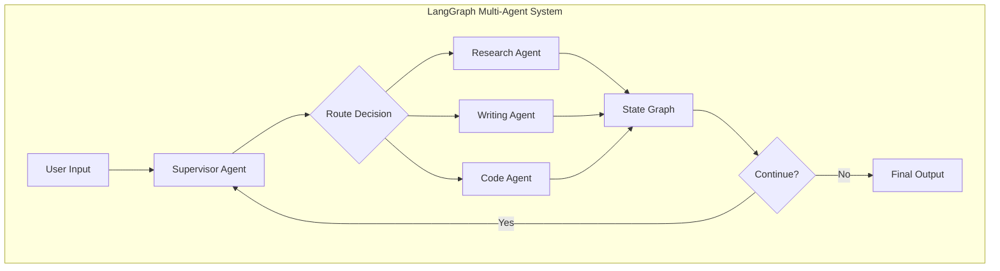
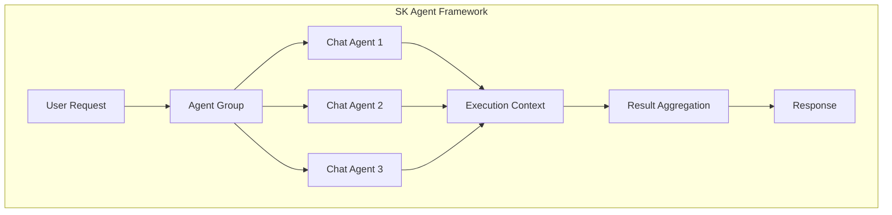

# 5. Comparative Analysis and Summary (2025 Edition)

> [!NOTE]
> This comprehensive analysis synthesizes the 2025 insights from our hands-on exploration of both frameworks, providing decision-making guidance based on production-ready implementation experience with the latest capabilities.

## 5.1 Architectural Deep Dive: 2025 Multi-Agent Capabilities

### 5.1.1 LangChain's Multi-Agent Architecture (2025)

LangChain leverages LangGraph for multi-agent systems with three primary patterns:

1. **Supervisor Pattern**: Central agent coordinates multiple specialized agents
2. **Sequential Pattern**: Agents work in pipeline fashion  
3. **Concurrent Pattern**: Parallel agent execution with result aggregation



### 5.1.2 Semantic Kernel's Agent Framework (2024)

SK's Agent Framework provides enterprise-ready orchestration with:

1. **Agent Groups**: Hierarchical agent organization
2. **Chat Completion Agents**: Conversational multi-turn capabilities
3. **Sequential/Concurrent Execution**: Built-in orchestration patterns



## 5.2 Framework Philosophy Comparison

**LangChain's "Compose Everything" Philosophy:**
- LCEL for linear composition with streaming support
- LangGraph for complex state management and cycles
- Function calling through tool binding
- Everything is composable and chainable

**Semantic Kernel's "Orchestrate Everything" Philosophy:**
- Plugin architecture with kernel-mediated execution
- Agent Framework for multi-agent coordination  
- Dependency injection and service registration
- Enterprise-focused patterns and governance

## 5.3 Production Readiness Comparison

| Aspect | LangChain | Semantic Kernel |
|--------|-----------|-----------------|
| **Enterprise Integration** | Community-driven, requires custom setup | Built for Microsoft ecosystem integration |
| **Debugging & Observability** | LangSmith (paid), custom tracing | Built-in telemetry, Azure Monitor integration |
| **Security & Governance** | Custom implementation required | Enterprise security patterns built-in |
| **Multi-Agent Orchestration** | LangGraph state management | Agent Framework with hierarchical control |
| **Function Calling** | Tool binding with LCEL | Plugin architecture with typed interfaces |
| **Streaming Support** | Native LCEL streaming | Custom implementation required |
| **Error Handling** | Custom retry/fallback logic | Built-in resilience patterns |

## 5.4 Use Case Decision Matrix

### 5.4.1 Choose LangChain When:

> [!TIP]
> LangChain excels in research, innovation, and rapid development scenarios.

- [x] **Rapid Prototyping**: Quick experimentation with AI workflows
- [x] **Research & Innovation**: Cutting-edge techniques and community contributions
- [x] **Complex Workflows**: Multi-step reasoning with state management via LangGraph
- [x] **Streaming Requirements**: Real-time response streaming is critical
- [x] **Open Source Preference**: Full control over dependencies and customization

### 5.4.2 Choose Semantic Kernel When:

> [!TIP]
> Semantic Kernel is optimized for enterprise production environments and Microsoft ecosystems.

- [x] **Enterprise Production**: Mission-critical applications requiring governance
- [x] **Microsoft Ecosystem**: Heavy Azure/Office 365 integration requirements  
- [x] **Team Collaboration**: Multiple developers with varying AI experience
- [x] **Compliance & Security**: Regulated industries with strict requirements
- [x] **Long-term Maintenance**: Stable APIs and enterprise support needed

## 5.5 Performance & Cost Analysis

### 5.5.1 LangChain Performance Characteristics:
- **Memory Usage**: Higher due to comprehensive feature set
- **Startup Time**: Slower initialization with full dependency loading
- **Runtime Performance**: Optimized for complex workflows
- **Token Efficiency**: Advanced prompt optimization and caching

### 5.5.2 Semantic Kernel Performance Characteristics:
- **Memory Usage**: Lighter footprint with modular plugin loading
- **Startup Time**: Fast initialization with dependency injection
- **Runtime Performance**: Optimized for enterprise workloads
- **Resource Management**: Better resource pooling and lifecycle management

## 5.6 Migration Strategies

### 5.6.1 From LangChain to Semantic Kernel:
1. **Plugin Migration**: Convert LangChain tools to SK functions with proper type annotations
2. **Agent Conversion**: Transform LangGraph workflows to Agent Framework patterns
3. **Prompt Migration**: Adapt prompt templates to SK's semantic function format
4. **Testing Strategy**: Maintain parallel implementations during transition period

### 5.6.2 From Semantic Kernel to LangChain:
1. **Chain Composition**: Convert SK plugins to LangChain tools and compose with LCEL
2. **State Management**: Implement LangGraph for complex multi-agent workflows
3. **Integration Layer**: Build adapters for existing Microsoft ecosystem dependencies
4. **Observability**: Implement LangSmith or custom tracing for production monitoring

## 5.7 2025 Evaluation Frameworks Comparison

### 5.7.1 LangChain 2025 Evaluation Ecosystem:

| Framework | Integration | Strengths | Best For |
|-----------|------------|-----------|----------|
| **LangSmith** | Native | Production monitoring, evaluation pipelines | Enterprise deployment |
| **DeepEval** | Excellent | Open-source, comprehensive metrics | Development & testing |
| **Custom Metrics** | Easy | Flexible evaluation criteria | Specialized use cases |

### 5.7.2 Semantic Kernel 2025 Evaluation Options:

| Framework | Integration | Strengths | Best For |
|-----------|------------|-----------|----------|
| **Azure Monitor** | Native | Enterprise monitoring, compliance | Production systems |
| **Custom Telemetry** | Built-in | Structured logging, metrics | Enterprise governance |
| **Third-Party Tools** | Manual | External evaluation frameworks | Specialized evaluation |

## 5.8 2025 Production Readiness Comparison

### 5.8.1 LangChain 2025 Production Features:
- ✅ **LangSmith Monitoring**: Native production observability
- ✅ **Memory Persistence**: PostgreSQL, Redis backends
- ✅ **Cost Tracking**: Built-in token usage monitoring
- ✅ **Error Handling**: Comprehensive retry and fallback mechanisms
- ✅ **Streaming**: Real-time updates with progress tracking
- ⚠️ **Enterprise Governance**: Requires custom implementation

### 5.8.2 Semantic Kernel 2025 Production Features:
- ✅ **Agent Framework 1.0**: Stable production API
- ✅ **Enterprise Governance**: Built-in compliance and audit
- ✅ **Process Framework**: Business workflow automation
- ✅ **Multi-Language Support**: C#, Python, Java consistency
- ✅ **Azure Integration**: Cloud-native deployment
- ⚠️ **Evaluation Frameworks**: Limited third-party options

## 5.9 2025 Migration and Convergence Strategies

### 5.9.1 AutoGen to Semantic Kernel Migration:
```python
# 2025 PATTERN: AutoGen migration to SK
from semantic_kernel.agents.autogen import AutoGenAgent

# Seamless migration path
migrated_agent = AutoGenAgent(
    kernel=sk_kernel,
    # Preserve AutoGen configuration
    llm_config=autogen_config,
    # Gain SK enterprise features
    compliance_mode=True
)
```

### 5.9.2 LangChain to Production Deployment:
```python
# 2025 PATTERN: LangChain production deployment
# Enable monitoring
os.environ['LANGCHAIN_TRACING_V2'] = 'true'

# Production-ready agent
agent = create_react_agent(
    model=llm,
    tools=tools,
    checkpointer=PostgresSaver(conn_string),
    # Production configuration
    memory_config={'max_history': 1000}
)
```

## 5.8 Community and Ecosystem

| Factor | LangChain | Semantic Kernel |
|--------|-----------|-----------------|
| **Community Size** | Large, active open source community | Growing Microsoft-backed community |
| **Documentation** | Extensive community docs, tutorials | Official Microsoft documentation |
| **Third-Party Integrations** | 700+ integrations available | Focused on Microsoft ecosystem |
| **Learning Resources** | Numerous courses, blogs, examples | Microsoft Learn modules, official guides |
| **Support Model** | Community + LangSmith commercial | Microsoft enterprise support |